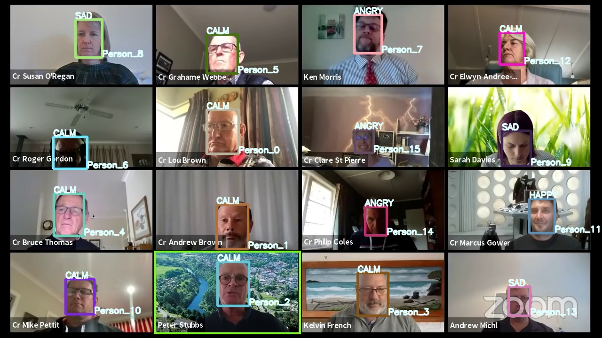
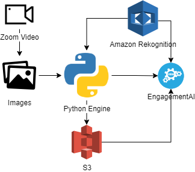

# EngagementAI

<center></center>

## Introduction
This project uses AWS Rekognition for emotion detection. Based on the emotion detected, further analysis is made
> **Motivation**: Due to lockdown., most of the lectures were arranged through video call. This work is an approach towards scoring the engagement of student during the lecture by identifying their emotions. We have used a very simple formula to calculate the Engagement score, which can be scaled to a more complex form.

        0.8*("CALM"+"HAPPY")-0.1*("SURPRISED"+"CONFUSED"+"ANGRY"+"SAD"+"DISGUSTED"+"FEAR")+0.2*("Marks Obtained"+0.1*"Question Asked")

## Demo Video
[](https://youtu.be/7PWvvyUwz-0)

## Technology used
-   Python
-   Amazon Web Services

## Workflow Diagram


User need to put the Zoom video recording at [./db/input/videos/SourceDump/](./db/input/videos/SourceDump/). Then execute [./app.py](./app.py). This Convert Video to images, do selection of images, face recogination, upload it in S3 and do the analysis based on the formula mentioned above. Final output will be in the form of [.xlsx](./FinalAnalysisReport.xlsx) file. Amazon Rekogination is used here to generate emotions in face and Cosine similarity to find out the particular person name in particular video frame.

## Folder Architecture

                C:.
                │   app.py
                │   README.md
                │   requirements.txt
                │
                ├───.vscode
                │       settings.json
                │
                ├───config
                │       credentials.json
                │
                ├───db
                │   ├───artifact
                │   ├───input
                │   │   ├───docs
                │   │   │       Marks.csv
                │   │   │       QnA.csv
                │   │   │       Research Export for analysis.xlsx
                │   │   │
                │   │   ├───images
                │   │   │       frame33.jpg
                │   │   │       output.jpg
                │   │   │
                │   │   ├───json
                │   │   │       frame33.json
                │   │   │
                │   │   └───videos
                │   │       ├───OutputDump
                │   │       └───SourceDump
                │   └───masterImg
                ├───notebook
                │       analysis.ipynb
                │
                ├───out
                └───src
                    │   engine.py
                    │
                    └───utils
                        │   face_detect.py
                        │   face_similarity.py
                        │   Videos2Images.py
                        │
                        └───models
                                haarcascade_frontalface_default.xml

## How to setup the environment for this project?
1. Install Anaconda from this link https://www.anaconda.com/products/individual#windows and follow the steps mentioned in following link
https://docs.anaconda.com/anaconda/install/windows/

2. After Anaconda installation, go to search and run Anaconda Prompt and create virtual environment using following commands.

    `conda create -n engagementai python=3.7.3`

    `conda activate engagementai`

3. Run Anaconda prompt and change the drive to the location to this directory and run command `python -m pip install -r requirements.txt`. This will install all the packages require for model execution.

## How to use this software?

Step 1:
Download Repository and dependencies
```bash
conda create -n engagementai python=3.7.3
```
```bash
conda activate engagementai
```

```bash
git clone https://github.com/ashishkrb7/EngagementAI.git
```
```bash
cd EngagementAI
```
```bash
python -m pip install -r requirements.txt
```
Step 2:
Modify [./config/credentials.json](./config/credentials.json)
```JSON
    {
        "User name": "ashish_temp",
        "Access key ID": "XXXX",
        "Secret access key": "XXXX",
        "Bucket_name":"rekoengagementai",
        "Folder_in_S3":"artifact"
    }
```
- Modify `Folder_in_S3` to avoid error or overwritting in S3
  
Step 3:

Modify *.csv for [Marks](./db/input/docs/Marks.csv) and [QnA](./db/input/docs/QnA.csv)

Step 4:
```bash
Python 3.7.3 (default, Apr 24 2019, 15:29:51) [MSC v.1915 64 bit (AMD64)] :: Anaconda, Inc. on win32
Type "help", "copyright", "credits" or "license" for more information.
>>> from src.engine import reset
>>> reset()
```

Step 5:
Download Video from this link "https://www.youtube.com/watch?v=53yPfrqbpkE&ab_channel=WaipaDistrictCouncil" and put downloaded file at `./db/input/videos/SourceDump/`

Step 6:
Run following command and follow the prompt instruction
```bash
python app.py
```

## Analysis

- [Notebook](./notebook/analysis.ipynb)
- [Final Excel](./FinalAnalysisReport.xlsx)

## Extra Code
-   `src\utils\face_detect.py` : To find the Face. In this we are using AWS Rekogination not this.
-   `src\utils\face_similarity.py` : To find the Cosine similarity between two images.

## License
```
Copyright (c) 2021 Ashish Kumar
```

## Author
Ashish Kumar

[](https://www.linkedin.com/in/ashishk766/) 
[](mailto:ashish.krb7@gmail.com) 

Made with ❤️ in India

## Contributors

<a href="https://github.com/ashishkrb7/EngagementAI/graphs/contributors">
  
</a>
